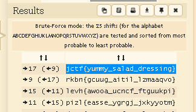

# salad

## Challenge Text
* Roman generals really knew how to make salad! `atkw{plddp_jrcru_uivjjzex}`

## Hint
* Look up some common types of ciphers

## Solution
* cypher text tersebut setelah dilihat bentuknya mirip dengan flag dan saya memastikan bahwa itu adalah caesar cypher, lalu saya menggukakan [dcode.fr](https://www.dcode.fr/caesar-cipher) dan saya mendapatkan flagnya.

* Flag: `jctf{yummy_salad_dressing}`
